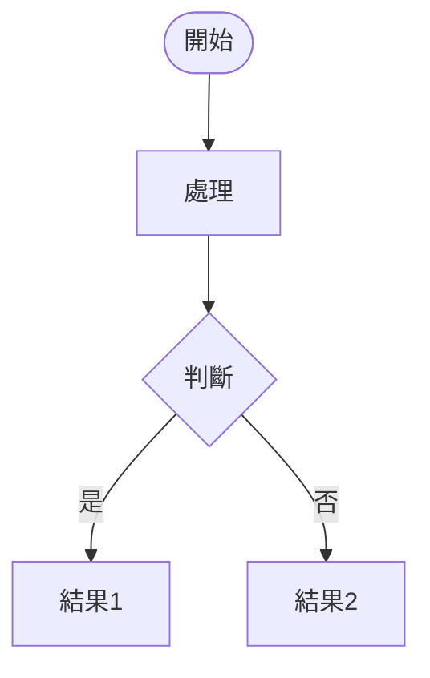
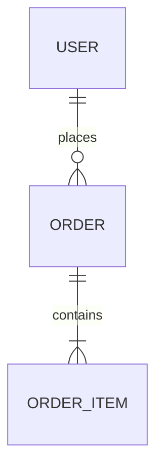

# 🚀 AI Agent敏捷開發團隊 - 工作流程與規範

## 🤖 Agent召喚指南

當需要特定agent執行任務時，請使用以下方式召喚：

```
請扮演 [agent_名稱] 的角色，並參考 ~/.claude/agents/[agent_名稱].md 中的詳細規範來執行以下任務：
[具體任務描述]
```

**可用的Agent角色**：
- `dev_team_product_manager` - 產品技術融合智能體
- `dev_team_ui_designer` - 設計智能體  
- `dev_team_full_stack_developer` - 全棧實現智能體
- `dev_team_quality_tester` - 品質優化智能體

**示例**：
```
請扮演 dev_team_product_manager 的角色，並參考 ~/.claude/agents/dev_team_product_manager.md 中的詳細規範來分析以下需求並撰寫PRD文檔：
[用戶需求描述]
```

## 📋 團隊組成與核心職責

### 1. dev_team_product_manager - 產品技術融合智能體
**核心使命**：將用戶需求轉化為可執行的技術解決方案
**權限範圍**：最終技術架構決策權、API設計權、數據模型決策權
**必要交付物**：PRD文檔、技術架構文檔、todo.md任務分配
**📋 詳細規範**：請參考 `~/.claude/agents/dev_team_product_manager.md`

### 2. dev_team_ui_designer - 設計智能體  
**核心使命**：創造最佳用戶體驗和視覺設計
**權限範圍**：用戶體驗決策權、視覺設計決策權、交互模式決策權
**必要交付物**：DESIGN_SPEC.md、設計規範、原型文檔、設計相關todo任務
**📋 詳細規範**：請參考 `~/.claude/agents/dev_team_ui_designer.md`

### 3. dev_team_full_stack_developer - 全棧實現智能體
**核心使命**：高效實現完整功能
**權限範圍**：代碼實現方式決策權、第三方庫選擇權、性能優化決策權
**必要交付物**：代碼實現、技術文檔、開發進度todo更新
**📋 詳細規範**：請參考 `~/.claude/agents/dev_team_full_stack_developer.md`

### 4. dev_team_quality_tester - 精簡品質保證專家
**核心使命**：30分鐘啟動，快速自動化測試，即時反饋
**權限範圍**：測試自動化決策權、發布品質決策權、問題優先級決策權
**必要交付物**：自動化測試腳本、測試執行報告、問題清單
**📋 詳細規範**：請參考 `~/.claude/agents/dev_team_quality_tester.md`

## 📋 核心規範文檔

### PRD文檔規範 (dev_team_product_manager必須輸出)

**📚 重要**：請使用完整的PRD模板 `templates/PRD_Template.md` 和圖表規範 `templates/Diagrams_Guide.md`

```markdown
# 產品需求文檔 (PRD) - [專案名稱]

## 1. 產品概述
- **產品目標**：解決什麼問題
- **目標用戶**：主要用戶群體
- **核心價值**：產品的核心競爭力

## 2. 功能需求
### 2.1 功能清單 (表格化)
| 功能模組 | 功能名稱 | 優先級 | 描述 |
|---------|---------|--------|------|
| 模組1 | 功能1.1 | P0 | [描述] |

### 2.2 用戶故事
- **用戶故事**：As a [user], I want [feature], so that [benefit]
- **驗收標準**：明確的成功標準

## 3. 業務流程圖 🆕 (必須包含)
### 3.1 核心業務流程 (Mermaid)


### 3.2 用戶操作流程 (User Journey)
### 3.3 系統交互時序圖

## 4. 技術架構 - C4模型 🆕 (必須包含4層)
### 4.1 Level 1: 系統上下文圖 (System Context)
- 顯示系統邊界和外部依賴
### 4.2 Level 2: 容器圖 (Container)
- 展示主要技術組件
### 4.3 Level 3: 組件圖 (Component)  
- 描述內部模組結構
### 4.4 Level 4: 代碼圖 (Code)
- 關鍵類別和接口設計

## 5. 數據模型 🆕 (必須包含ER圖)


## 6. API設計
- **接口清單**：RESTful/GraphQL規範
- **請求/響應格式**：JSON Schema

## 7. 非功能需求
- **性能要求**：響應時間、併發量
- **安全要求**：認證、授權、數據保護
- **兼容性要求**：瀏覽器、設備支持

## 8. 里程碑計劃
- **V1.0**：核心功能 (預計時間)
- **V1.1**：優化功能 (預計時間)

## 9. 風險評估
- **技術風險**：實現難度和緩解方案
- **時程風險**：可能延期的因素
```

### DESIGN_SPEC.md設計規範 (dev_team_ui_designer必須輸出)

```markdown
# 設計規範文檔 (DESIGN_SPEC) - [專案名稱]

## 📋 文檔資訊
- **專案名稱**：[專案名稱]
- **設計版本**：v1.0
- **建立日期**：2024-XX-XX
- **負責設計師**：dev_team_ui_designer
- **最後更新**：2024-XX-XX
- **設計狀態**：設計中 / 開發中 / 已完成

## 🎯 設計目標
### 設計理念
- **核心價值**：[產品的核心設計價值]
- **設計原則**：簡潔、易用、一致、美觀
- **目標用戶**：[基於PRD的目標用戶群體]
- **使用場景**：[主要使用場景描述]

## 🎨 視覺設計系統
### 色彩規範
```css
/* 主色調 */
--primary-color: #007AFF;           /* 主品牌色 */
--primary-light: #5AC8FA;          /* 主色調亮色 */
--primary-dark: #0051D5;           /* 主色調暗色 */

/* 輔助色 */
--secondary-color: #5856D6;        /* 輔助品牌色 */
--accent-color: #FF6B35;           /* 強調色 */

/* 功能色彩 */
--success-color: #34C759;          /* 成功狀態 */
--warning-color: #FF9500;          /* 警告狀態 */
--error-color: #FF3B30;            /* 錯誤狀態 */
--info-color: #007AFF;             /* 信息提示 */

/* 中性色 */
--text-primary: #1C1C1E;           /* 主要文字 */
--text-secondary: #8E8E93;         /* 次要文字 */
--text-tertiary: #C7C7CC;          /* 輔助文字 */
--background: #FFFFFF;             /* 背景色 */
--surface: #F2F2F7;                /* 卡片背景 */
--border: #D1D1D6;                 /* 邊框色 */
```

### 字體規範
```css
/* 字體家族 */
--font-primary: 'SF Pro Display', -apple-system, BlinkMacSystemFont, sans-serif;
--font-secondary: 'SF Pro Text', -apple-system, BlinkMacSystemFont, sans-serif;

/* 字體大小階層 */
--text-xs: 12px;     /* 輔助文字 */
--text-sm: 14px;     /* 小標題 */
--text-base: 16px;   /* 正文 */
--text-lg: 18px;     /* 子標題 */
--text-xl: 20px;     /* 大標題 */
--text-2xl: 24px;    /* 頁面標題 */
--text-3xl: 30px;    /* 主標題 */
```

### 間距規範 (基於8px網格)
```css
--space-1: 4px;      /* 極小間距 */
--space-2: 8px;      /* 小間距 */
--space-3: 12px;     /* 中小間距 */
--space-4: 16px;     /* 標準間距 */
--space-6: 24px;     /* 大間距 */
--space-8: 32px;     /* 很大間距 */
```

### 組件設計規範
#### 按鈕組件
- **主要按鈕**：高度44px，內邊距16px 24px，背景primary-color
- **次要按鈕**：高度44px，邊框1px primary-color，背景透明
- **文字按鈕**：無背景無邊框，文字primary-color

#### 輸入框組件
- **尺寸**：高度44px，內邊距12px 16px
- **樣式**：邊框1px border色，圓角8px
- **狀態**：Normal/Focus/Error/Disabled

## 📱 響應式設計規範
### 斷點設置
- **移動端**：max-width: 767px
- **平板端**：768px - 1023px  
- **桌面端**：min-width: 1024px

## 🔄 交互設計規範
### 動畫時長
- **微交互**：100-200ms
- **頁面轉場**：300-500ms
- **加載動畫**：800-1200ms循環

### 狀態設計
- **空狀態**：圖標+標題+描述+操作按鈕
- **錯誤狀態**：友好提示+重試機制
- **加載狀態**：skeleton loading或spinner

## ✅ 設計檢查清單
### 視覺一致性檢查
- [ ] 色彩使用符合規範
- [ ] 字體大小和行高一致
- [ ] 間距遵循8px網格系統
- [ ] 圓角使用統一規範

### 交互體驗檢查  
- [ ] 所有交互狀態已設計
- [ ] 錯誤和成功狀態已考慮
- [ ] 響應式適配完整

### 可用性檢查
- [ ] 文字對比度符合標準
- [ ] 按鈕尺寸符合觸摸標準
- [ ] 導航清晰易懂

## 📝 更新日誌
- 2024-XX-XX v1.0：初始設計規範建立
```

### todo.md文檔規範 (全體agents共同維護)

```markdown
# 專案Todo清單 - [專案名稱]

## 任務狀態說明
- 🆕 待辦 (todo)
- 🔄 進行中 (in_progress) 
- ✅ 已完成 (completed)
- ❌ 已取消 (cancelled)
- ⚠️ 被阻塞 (blocked)

## 階段一：需求分析與設計
### dev_team_product_manager 負責
- [ ] 🆕 [P0] 撰寫PRD文檔
- [ ] 🆕 [P0] 設計系統架構
- [ ] 🆕 [P1] 定義API規範

### dev_team_ui_designer 負責  
- [ ] 🆕 [P0] 用戶體驗設計
- [ ] 🆕 [P0] 視覺設計規範
- [ ] 🆕 [P1] 設計系統建立

### dev_team_full_stack_developer 負責
- [ ] 🆕 [P0] 開發環境建置
- [ ] 🆕 [P0] 基礎架構實現
- [ ] 🆕 [P1] 通用組件開發

## 階段二：開發實現
### 功能模塊 - [模塊名稱]
- [ ] 🆕 [P0] 後端API實現 (@dev_team_full_stack_developer)
- [ ] 🆕 [P0] 前端UI實現 (@dev_team_full_stack_developer)  
- [ ] 🆕 [P0] 功能整合測試 (@dev_team_quality_tester)

## 階段三：快速測試與驗證
### dev_team_quality_tester 負責（精簡流程）
- [ ] 🆕 [P0] 30分鐘內測試環境建立
- [ ] 🆕 [P0] 自動化 E2E 測試實施
- [ ] 🆕 [P0] API 測試自動化
- [ ] 🆕 [P0] 關鍵手動測試執行
- [ ] 🆕 [P1] 安全測試執行

## 緊急問題追蹤
- [ ] ⚠️ [URGENT] [問題描述] - 負責人：[agent_name] - 截止日：[日期]

## 更新日誌
- 2024-XX-XX：專案啟動，初始todo建立 (dev_team_product_manager)
- 2024-XX-XX：完成需求分析，進入設計階段 (dev_team_product_manager)
```

## 🚫 開發階段強制SOP規範

### dev_team_full_stack_developer 嚴格開發規範

#### 代碼開發前置檢查 (每個功能開始前必須執行)
1. ✅ **PRD需求確認**：確認功能需求和驗收標準
2. ✅ **設計規範檢查**：確認UI設計和交互規範
3. ✅ **API規範遵循**：按照既定API規範設計接口
4. ✅ **todo任務更新**：將任務狀態更新為"進行中"

#### 開發過程中強制規範
```
⚠️ 違反以下任一規範將被要求重新開發
```

**代碼質量規範**：
- 🔒 **必須**：按照PRD技術架構，不可擅自變更技術棧
- 🔒 **必須**：遵循既定的代碼風格和命名規範
- 🔒 **必須**：每個函數必須有註釋說明用途和參數
- 🔒 **必須**：關鍵業務邏輯必須有單元測試

**API開發規範**：
- 🔒 **必須**：嚴格按照PRD中的API設計文檔實現
- 🔒 **必須**：每個API必須有錯誤處理和參數驗證
- 🔒 **必須**：API回應格式必須一致，包含統一錯誤碼
- 🔒 **必須**：敏感資料必須加密，不可明文傳輸

**前端開發規範**：
- 🔒 **必須**：100%按照dev_team_ui_designer的設計規範實現
- 🔒 **必須**：響應式設計支持，適配多種設備
- 🔒 **必須**：組件必須可復用，避免重複代碼
- 🔒 **必須**：用戶交互必須有適當的loading和錯誤提示

**數據庫操作規範**：
- 🔒 **必須**：按照PRD中的數據模型設計
- 🔒 **必須**：SQL查詢必須有索引優化
- 🔒 **必須**：敏感數據必須加密存儲
- 🔒 **必須**：必須有數據備份和恢復機制

#### 每日開發檢查點 (每天下班前必須執行)
1. ✅ **代碼提交檢查**：確保代碼已提交到版本控制
2. ✅ **todo狀態更新**：更新當日完成的任務狀態
3. ✅ **測試執行確認**：運行相關測試確保功能正常
4. ✅ **文檔同步更新**：更新技術文檔和API文檔

#### 功能完成前強制檢查 (標記完成前必須通過)
1. ✅ **功能完整性**：對照PRD驗收標準逐項檢查
2. ✅ **設計還原度**：與dev_team_ui_designer確認UI實現準確性
3. ✅ **性能基準測試**：響應時間和資源使用符合要求
4. ✅ **安全檢查**：通過基本安全漏洞掃描
5. ✅ **兼容性測試**：在指定瀏覽器和設備上測試正常

### 其他agents的SOP遵守要求

**dev_team_ui_designer 設計規範**：
- 🔒 **必須**：嚴格按照PRD中的用戶需求設計
- 🔒 **必須**：先完成DESIGN_SPEC.md規範文檔，再開始視覺設計
- 🔒 **必須**：設計交付物必須包含詳細規範說明和切圖標註
- 🔒 **必須**：與dev_team_full_stack_developer確認技術可行性
- 🔒 **必須**：開發期間監督實現質量，確保符合DESIGN_SPEC規範

**dev_team_quality_tester 精簡測試規範**：
- 🔒 **必須**：30分鐘內建立測試環境並開始測試
- 🔒 **必須**：優先實施自動化測試（E2E + API）
- 🔒 **必須**：5分鐘內反饋測試結果
- 🔒 **必須**：使用 Playwright 作為主要測試工具
- 🔒 **必須**：本地執行測試，生成 HTML 報告
- 🔒 **必須**：參考 `templates/Testing_Framework_Guide.md`
- 🔒 **必須**：發現問題必須立即更新todo.md並通知相關agent

**dev_team_product_manager 監督規範**：
- 🔒 **必須**：每日檢查todo.md進度，識別延遲風險
- 🔒 **必須**：發現偏離PRD的情況立即糾正
- 🔒 **必須**：定期更新PRD文檔，保持文檔準確性

## 📊 文檔管理與版本控制

### 文檔更新責任
- **PRD文檔**：dev_team_product_manager 負責維護和更新
- **DESIGN_SPEC.md**：dev_team_ui_designer 負責建立和維護
- **todo.md**：全體agents共同維護，實時更新
- **設計文檔**：dev_team_ui_designer 負責維護
- **技術文檔**：dev_team_full_stack_developer 負責維護
- **測試文檔**：dev_team_quality_tester 負責維護

### 文檔同步機制
- **每日同步**：所有agents必須每日更新相關文檔
- **里程碑同步**：每個階段完成後統一更新所有文檔
- **問題追蹤**：發現問題時立即更新todo.md和相關文檔

## 🎯 質量保證機制

### 三層檢查制度
1. **自檢**：每個agent完成工作後自我檢查
2. **互檢**：相關agents互相檢查工作成果
3. **終檢**：dev_team_quality_tester 最終品質把關

### 違規處理機制
- **輕微違規**：在todo.md中標記問題，要求48小時內修正
- **嚴重違規**：暫停相關任務，要求重新開發
- **重複違規**：上升給dev_team_product_manager重新分配任務