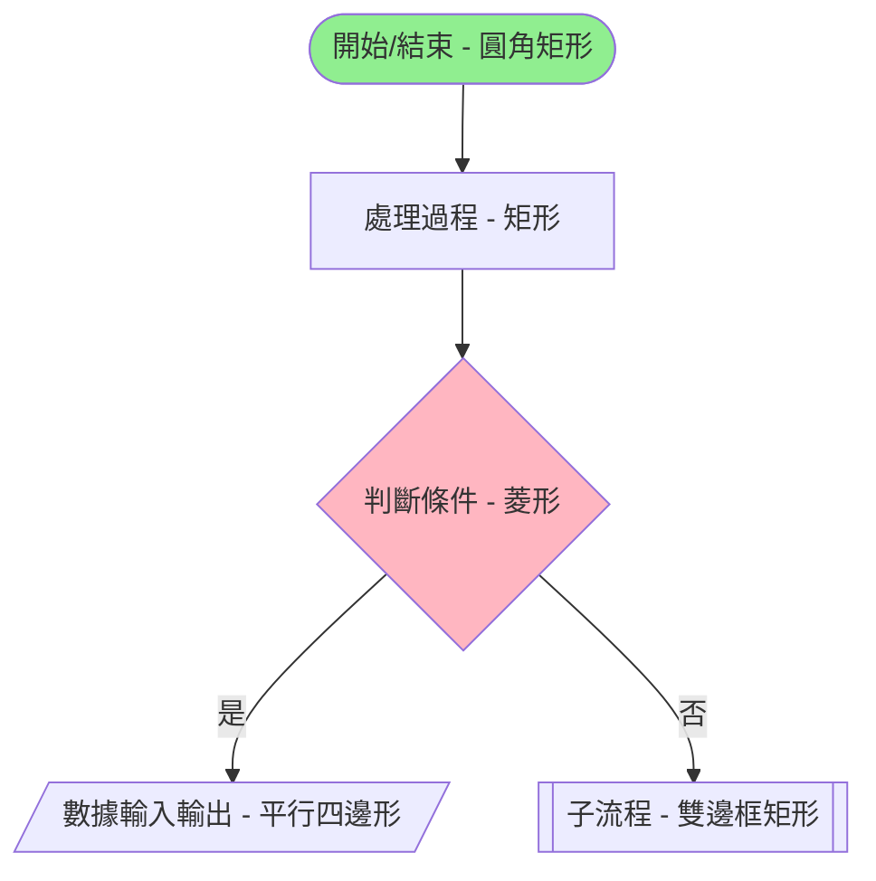
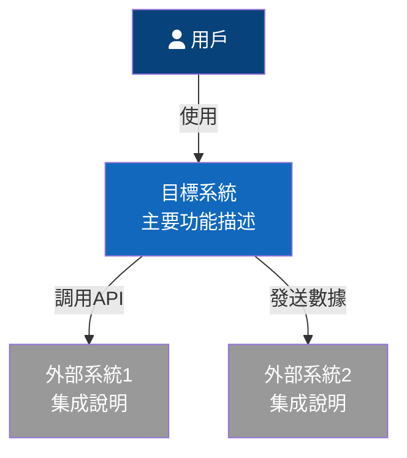
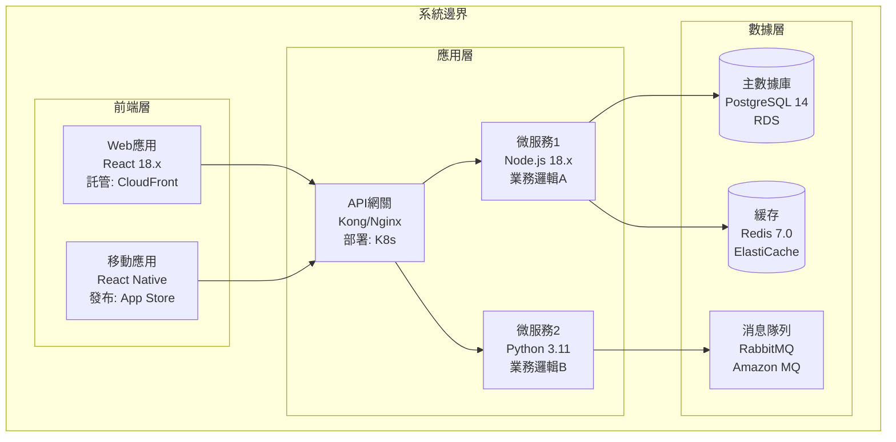
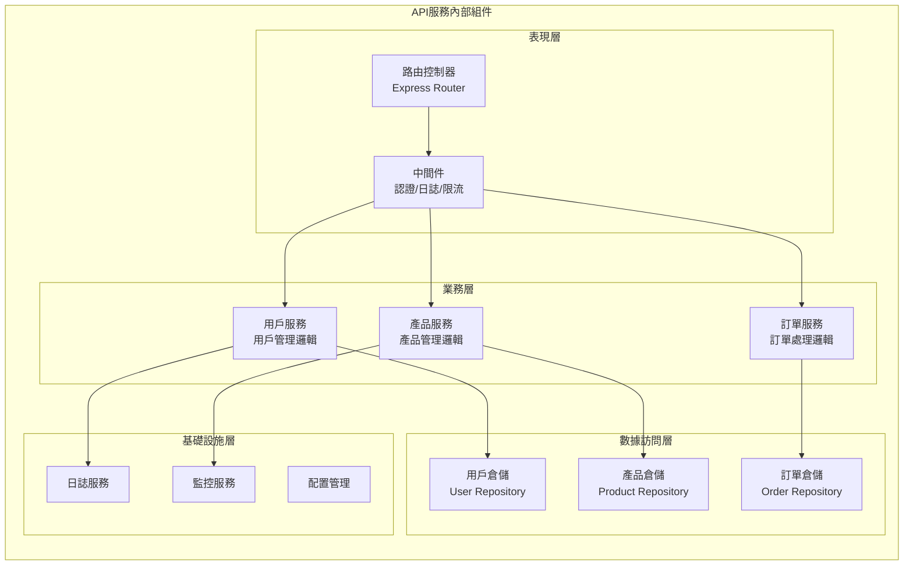
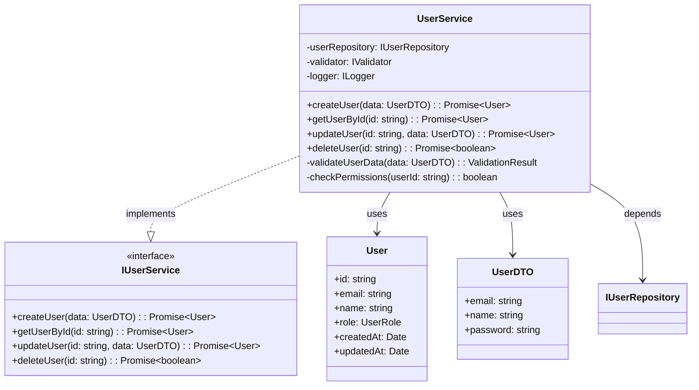
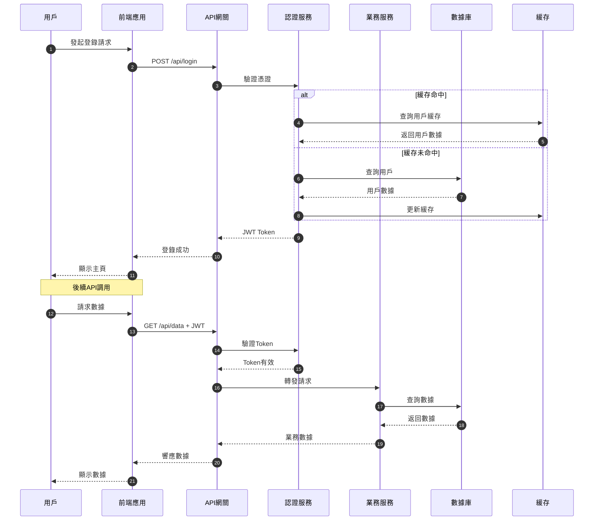
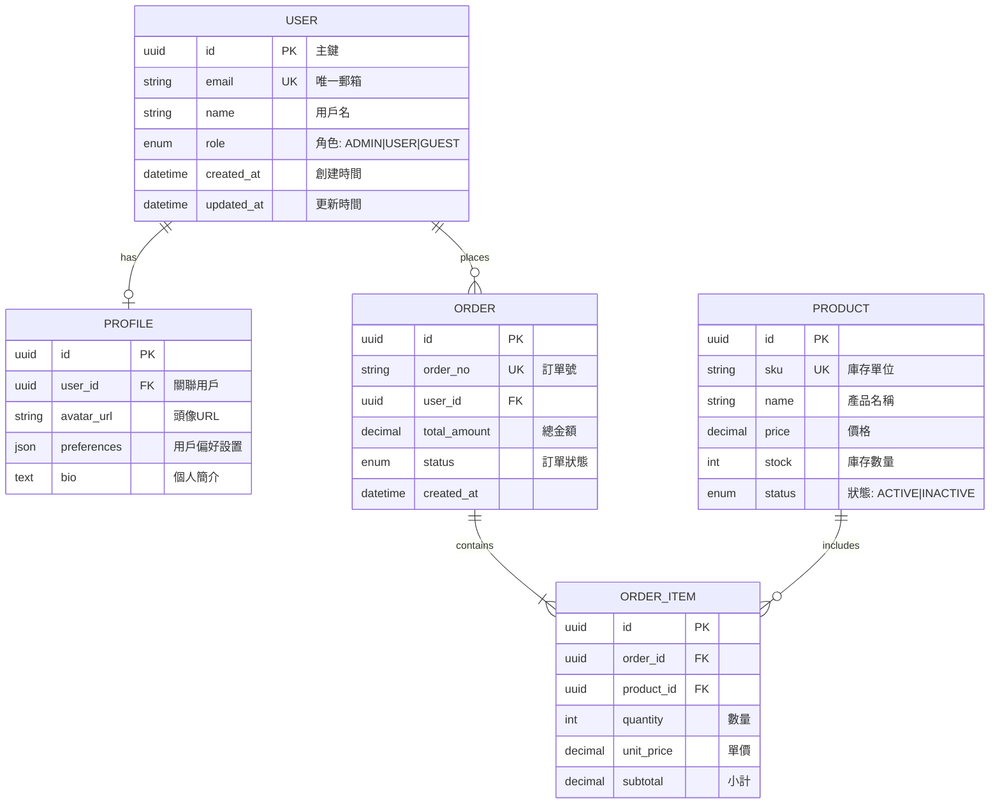

# 📊 圖表規範指南 - 流程圖與架構圖標準

## 🎯 概述

本指南定義了在 AI Agent 開發團隊中使用的各類圖表標準，確保所有 agent 產出的技術文檔具有一致性和專業性。

## 📋 圖表類型與用途

### 1. 流程圖 (Flowchart)
**用途**：描述業務流程、算法邏輯、決策過程
**負責Agent**：agent_product_manager, agent_ui_designer
**使用工具**：Mermaid, PlantUML

### 2. C4 架構圖 (C4 Model)
**用途**：系統架構的多層次描述
**負責Agent**：agent_product_manager, agent_full_stack_developer
**使用工具**：Mermaid, PlantUML, Structurizr

### 3. 時序圖 (Sequence Diagram)
**用途**：描述系統組件間的交互時序
**負責Agent**：agent_full_stack_developer
**使用工具**：Mermaid, PlantUML

### 4. ER圖 (Entity Relationship)
**用途**：數據模型設計
**負責Agent**：agent_product_manager, agent_full_stack_developer
**使用工具**：Mermaid, dbdiagram.io

## 🔧 工具使用規範

### Mermaid 使用規範

#### 流程圖語法

#### C4 模型 - Level 1: 系統上下文

#### C4 模型 - Level 2: 容器圖

#### C4 模型 - Level 3: 組件圖

#### C4 模型 - Level 4: 代碼級別

### 時序圖規範

### ER圖規範

## 📐 圖表設計原則

### 1. 一致性原則
- 使用統一的顏色方案
- 保持相同的符號約定
- 遵循統一的命名規範

### 2. 簡潔性原則
- 避免過度複雜的圖表
- 每個圖表聚焦單一主題
- 適當使用子圖分解複雜度

### 3. 可讀性原則
- 添加必要的註釋和說明
- 使用清晰的標籤
- 保持合理的佈局間距

### 4. 完整性原則
- 包含所有關鍵組件
- 標註重要的數據流向
- 說明關鍵的技術決策

## 🎨 顏色規範

### 系統組件顏色
- 🟦 **核心系統**：#1168BD
- 🟩 **內部服務**：#438543
- 🟨 **外部系統**：#999999
- 🟥 **用戶/角色**：#08427B

### 狀態顏色
- ✅ **成功/正常**：#90EE90
- ⚠️ **警告/待定**：#FFD700
- ❌ **錯誤/失敗**：#FF6B6B
- ℹ️ **信息/說明**：#87CEEB

## 📝 文檔集成規範

### 在PRD中使用
1. 業務流程圖必須包含在「業務流程」章節
2. C4架構圖必須包含在「技術架構」章節
3. 數據模型ER圖必須包含在「數據模型」章節

### 在技術文檔中使用
1. API時序圖用於說明接口調用流程
2. 組件圖用於說明模組依賴關係
3. 類圖用於說明代碼結構

## 🔄 更新維護

### 版本控制
- 圖表源碼與文檔一起進行版本控制
- 重大變更需要標註版本號
- 保留歷史版本供追溯

### 同步更新
- 代碼變更時同步更新架構圖
- 業務流程調整時更新流程圖
- 數據模型變更時更新ER圖

## 📚 參考資源

### 官方文檔
- [Mermaid官方文檔](https://mermaid-js.github.io/)
- [C4 Model官網](https://c4model.com/)
- [PlantUML文檔](https://plantuml.com/)

### 最佳實踐
- [架構圖繪製最佳實踐](https://www.infoq.cn/article/architecture-diagrams)
- [流程圖設計指南](https://www.lucidchart.com/blog/flowchart-best-practices)

---

**重要提示**：
- 所有Agent在產出技術文檔時必須遵循本規範
- 圖表是溝通的重要工具，請確保準確性和可讀性
- 定期review和更新圖表，保持與實際系統的一致性