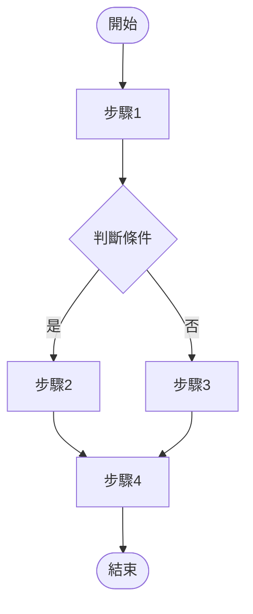
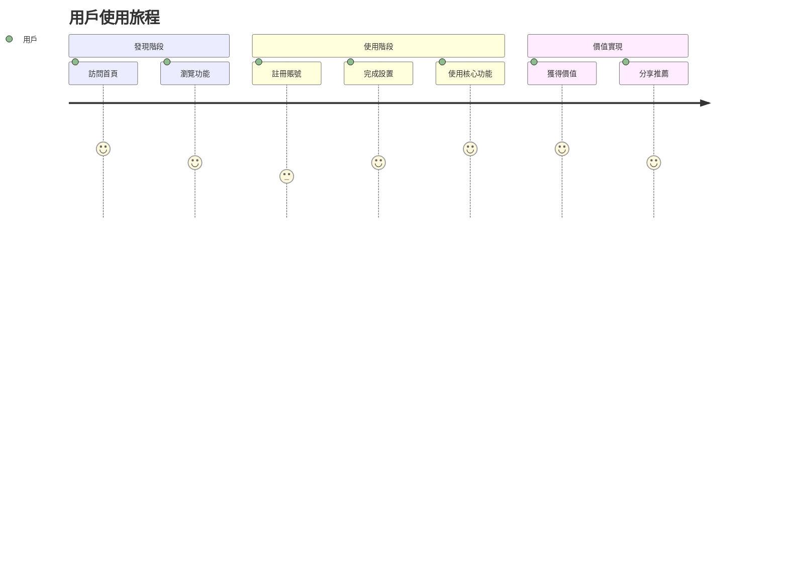
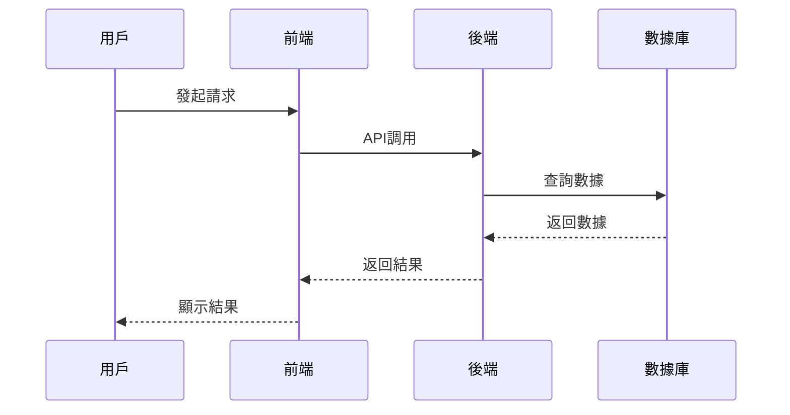
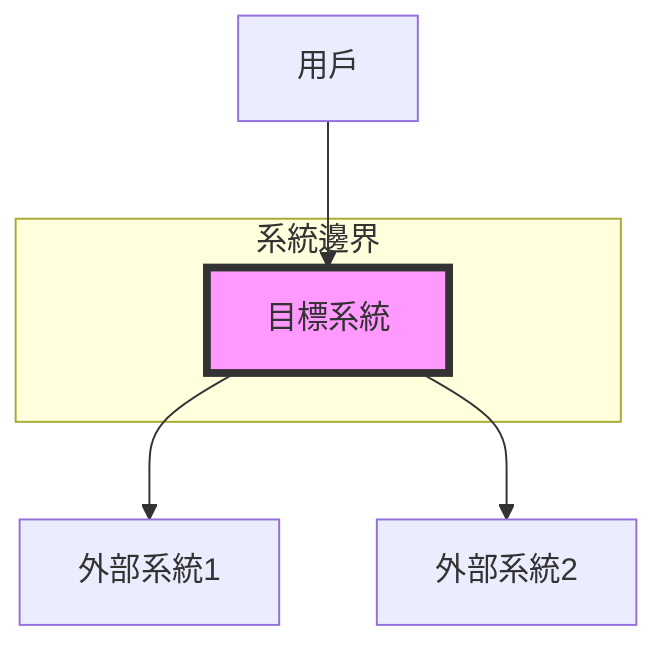
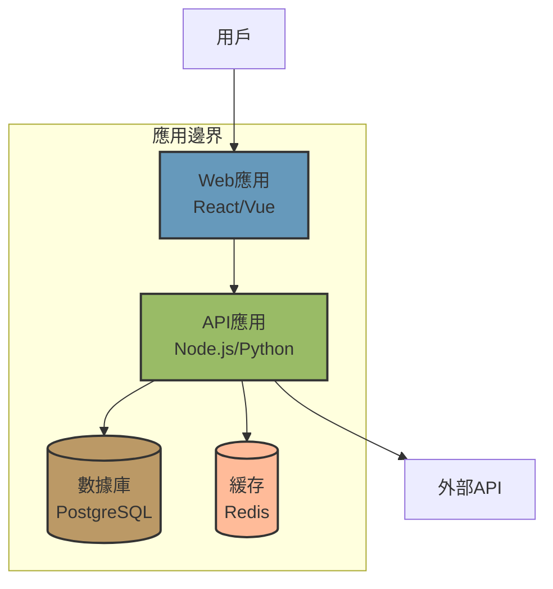
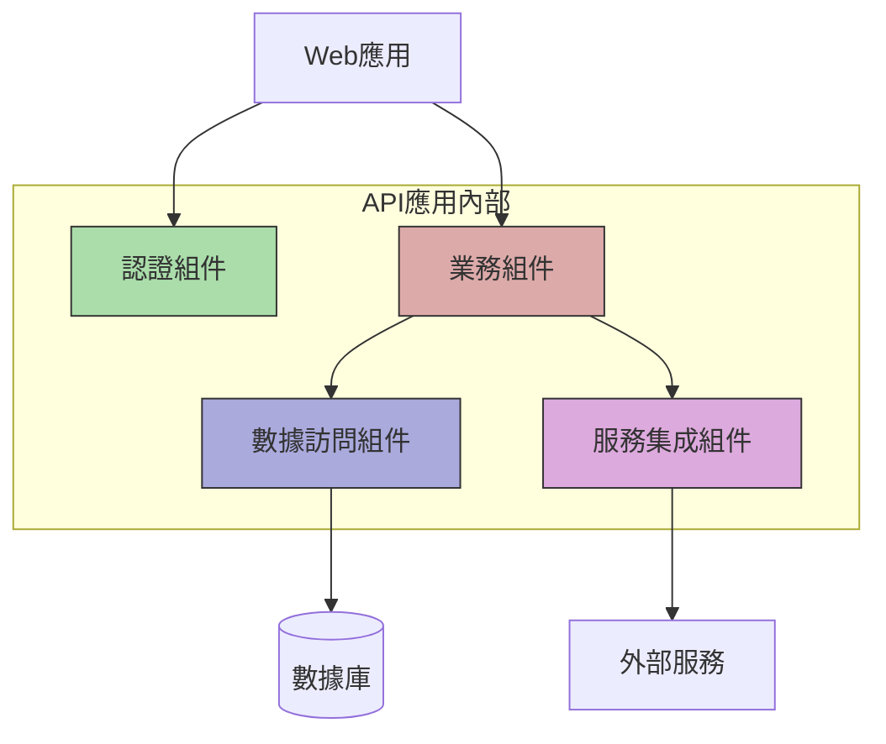
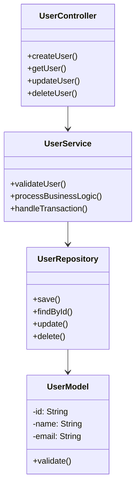
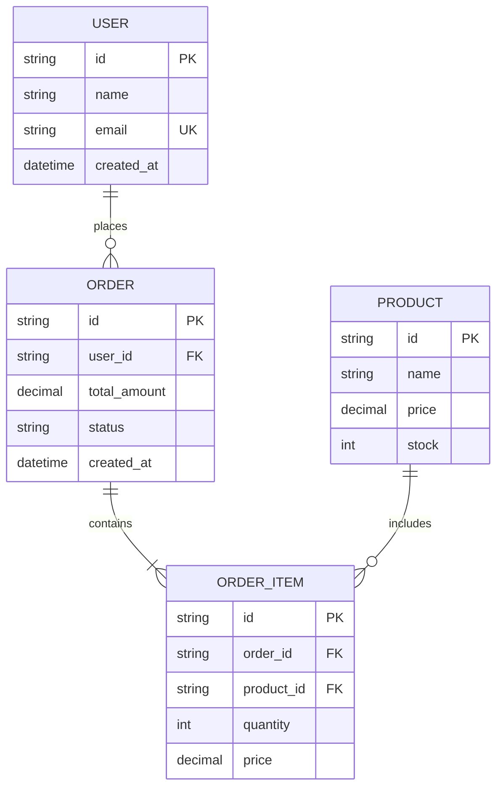

# 產品需求文檔 (PRD) 模板 - [專案名稱]

## 📋 文檔元數據
- **版本**：v1.0.0
- **作者**：agent_product_manager
- **創建日期**：YYYY-MM-DD
- **最後更新**：YYYY-MM-DD
- **狀態**：草稿/評審中/已批准

## 📖 目錄
1. [產品概述](#產品概述)
2. [需求背景](#需求背景)
3. [目標用戶](#目標用戶)
4. [功能需求](#功能需求)
5. [業務流程圖](#業務流程圖)
6. [技術架構（C4模型）](#技術架構c4模型)
7. [非功能需求](#非功能需求)
8. [數據模型](#數據模型)
9. [API設計](#api設計)
10. [驗收標準](#驗收標準)

## 1. 產品概述

### 1.1 產品願景
[描述產品的長期目標和價值主張]

### 1.2 產品定位
[說明產品在市場中的位置和差異化策略]

### 1.3 核心價值
- **價值點1**：[說明]
- **價值點2**：[說明]
- **價值點3**：[說明]

## 2. 需求背景

### 2.1 問題陳述
[描述現有問題和痛點]

### 2.2 解決方案
[提出的解決方案概述]

### 2.3 成功指標
- **KPI 1**：[指標定義和目標值]
- **KPI 2**：[指標定義和目標值]
- **KPI 3**：[指標定義和目標值]

## 3. 目標用戶

### 3.1 用戶畫像
| 用戶類型 | 特徵描述 | 使用場景 | 核心需求 |
|---------|---------|---------|---------|
| 主要用戶 | [特徵] | [場景] | [需求] |
| 次要用戶 | [特徵] | [場景] | [需求] |

### 3.2 用戶故事
```
作為 [用戶角色]
我想要 [功能/特性]
以便於 [價值/好處]
```

## 4. 功能需求

### 4.1 功能清單
| 功能模組 | 功能名稱 | 優先級 | 描述 | 備註 |
|---------|---------|--------|------|------|
| 模組1 | 功能1.1 | P0 | [描述] | [備註] |
| 模組1 | 功能1.2 | P1 | [描述] | [備註] |
| 模組2 | 功能2.1 | P0 | [描述] | [備註] |

### 4.2 功能詳細說明
#### 功能1：[功能名稱]
- **功能描述**：[詳細描述]
- **業務規則**：
  1. [規則1]
  2. [規則2]
- **輸入/輸出**：
  - 輸入：[說明]
  - 輸出：[說明]
- **異常處理**：[說明]

## 5. 業務流程圖

### 5.1 核心業務流程


### 5.2 用戶操作流程


### 5.3 系統交互時序圖


## 6. 技術架構（C4模型）

### 6.1 Level 1: 系統上下文圖（System Context）


**說明**：
- **目標系統**：[系統描述]
- **用戶**：[用戶類型和交互方式]
- **外部系統1**：[系統描述和集成方式]
- **外部系統2**：[系統描述和集成方式]

### 6.2 Level 2: 容器圖（Container）


**容器說明**：
| 容器 | 技術棧 | 職責 | 部署方式 |
|------|--------|------|----------|
| Web應用 | React/Vue | 用戶界面 | CDN + Nginx |
| API應用 | Node.js | 業務邏輯 | Docker/K8s |
| 數據庫 | PostgreSQL | 數據持久化 | RDS/自建 |
| 緩存 | Redis | 性能優化 | ElastiCache |

### 6.3 Level 3: 組件圖（Component）


**組件說明**：
- **認證組件**：處理用戶認證和授權
- **業務組件**：核心業務邏輯實現
- **數據訪問組件**：數據庫操作和ORM
- **服務集成組件**：外部服務調用和集成

### 6.4 Level 4: 代碼圖（Code）


## 7. 非功能需求

### 7.1 性能需求
- **響應時間**：API響應 < 200ms (P95)
- **並發量**：支持 1000 TPS
- **可用性**：99.9% SLA

### 7.2 安全需求
- **認證方式**：JWT Token
- **數據加密**：TLS 1.3
- **權限控制**：RBAC

### 7.3 可擴展性
- **水平擴展**：支持自動擴縮容
- **垂直擴展**：模組化設計

## 8. 數據模型

### 8.1 ER圖


### 8.2 數據字典
| 表名 | 字段名 | 類型 | 約束 | 說明 |
|------|--------|------|------|------|
| users | id | UUID | PK | 用戶ID |
| users | email | VARCHAR(255) | UK, NOT NULL | 郵箱 |

## 9. API設計

### 9.1 API清單
| API路徑 | 方法 | 描述 | 請求示例 | 響應示例 |
|---------|------|------|----------|----------|
| /api/v1/users | GET | 獲取用戶列表 | - | [響應] |
| /api/v1/users/:id | GET | 獲取用戶詳情 | - | [響應] |
| /api/v1/users | POST | 創建用戶 | [請求] | [響應] |

### 9.2 API詳細設計
```yaml
openapi: 3.0.0
paths:
  /api/v1/users:
    post:
      summary: 創建新用戶
      requestBody:
        required: true
        content:
          application/json:
            schema:
              type: object
              properties:
                name:
                  type: string
                email:
                  type: string
      responses:
        '201':
          description: 創建成功
        '400':
          description: 請求錯誤
```

## 10. 驗收標準

### 10.1 功能驗收
- [ ] 所有P0功能已實現並通過測試
- [ ] 所有P1功能已實現並通過測試
- [ ] 用戶流程順暢無阻塞

### 10.2 性能驗收
- [ ] 響應時間符合要求
- [ ] 並發處理能力達標
- [ ] 系統穩定性測試通過

### 10.3 安全驗收
- [ ] 安全漏洞掃描通過
- [ ] 權限控制測試通過
- [ ] 數據加密驗證通過

## 附錄

### A. 術語表
| 術語 | 定義 | 說明 |
|------|------|------|
| [術語1] | [定義] | [說明] |

### B. 參考資料
1. [參考文檔1]
2. [參考文檔2]

### C. 修訂歷史
| 版本 | 日期 | 修改人 | 修改內容 |
|------|------|--------|----------|
| v1.0.0 | YYYY-MM-DD | agent_product_manager | 初始版本 |

---
**文檔狀態說明**：
- 🟢 **已批准**：可以開始實施
- 🟡 **評審中**：等待相關方確認
- 🔴 **草稿**：仍在編寫中